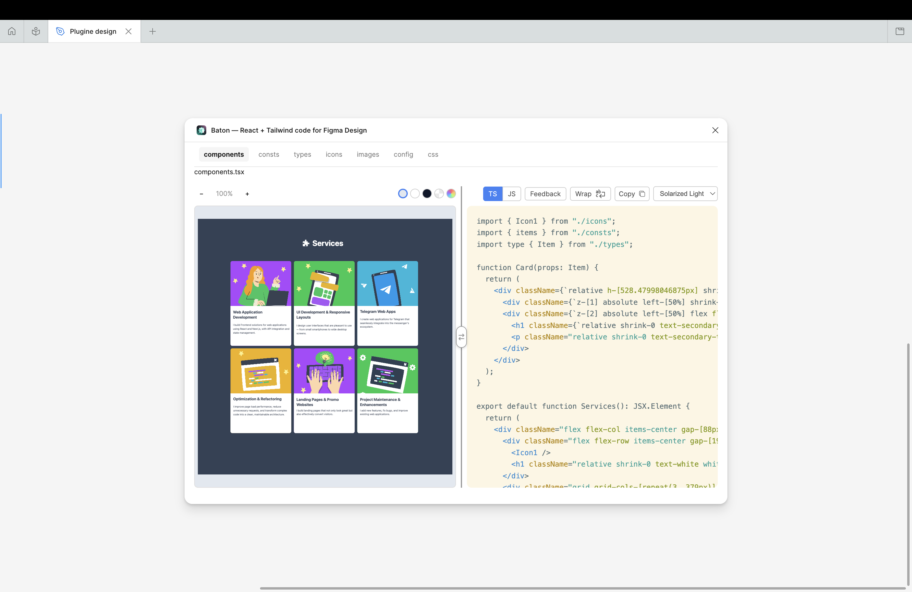
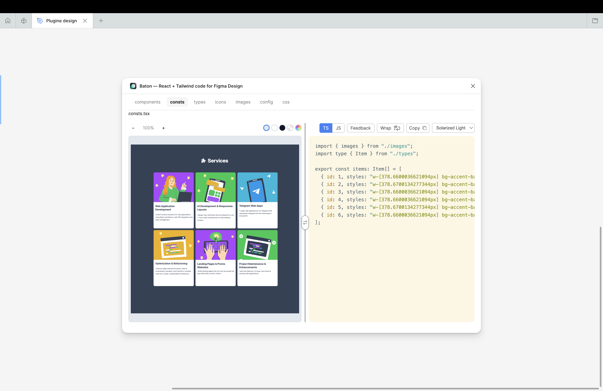
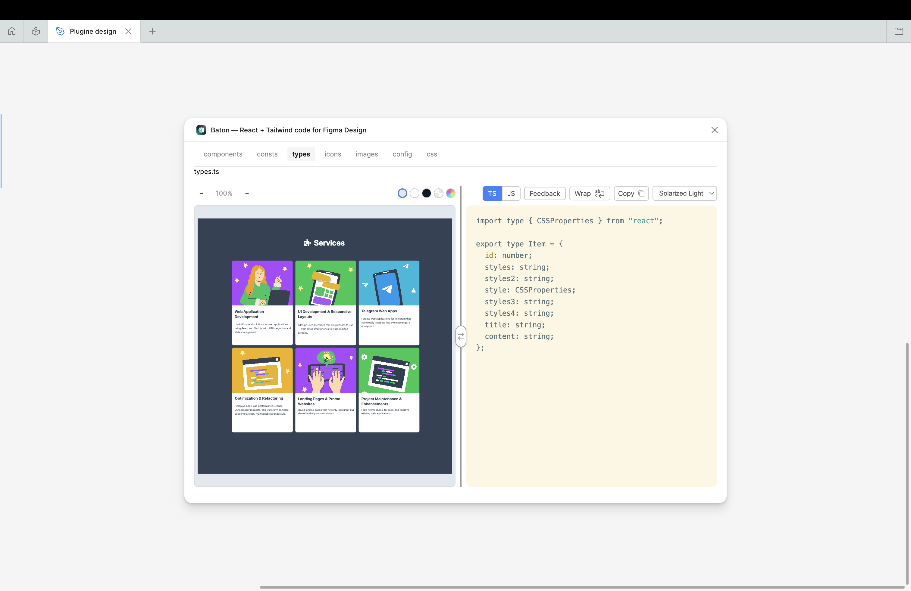
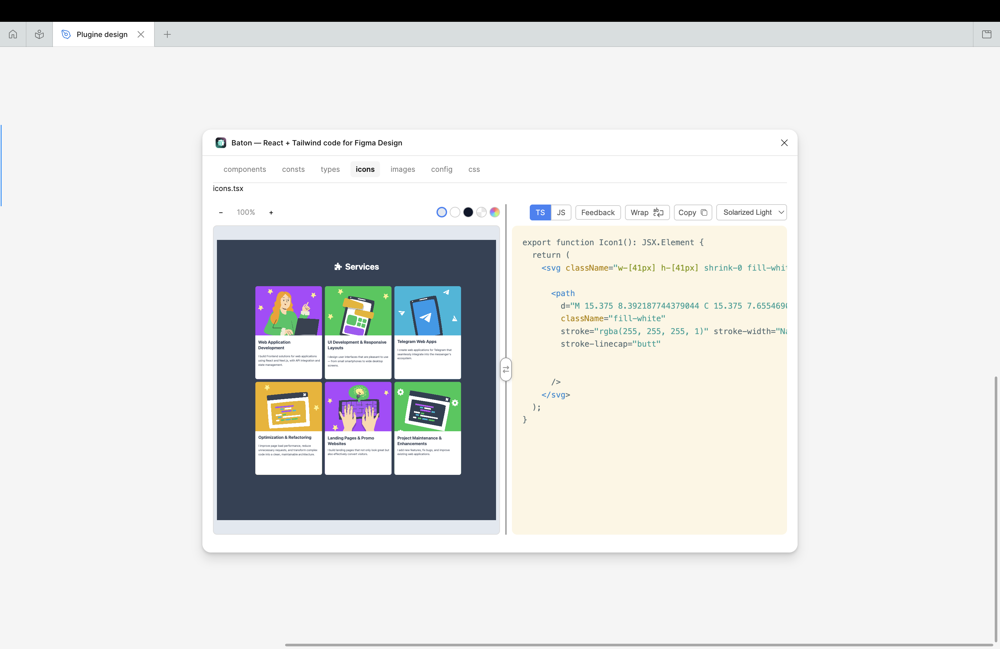
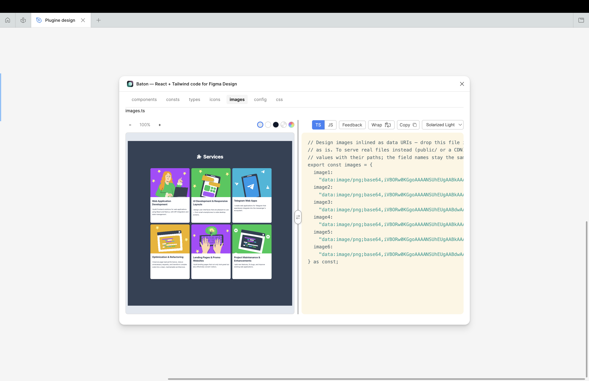
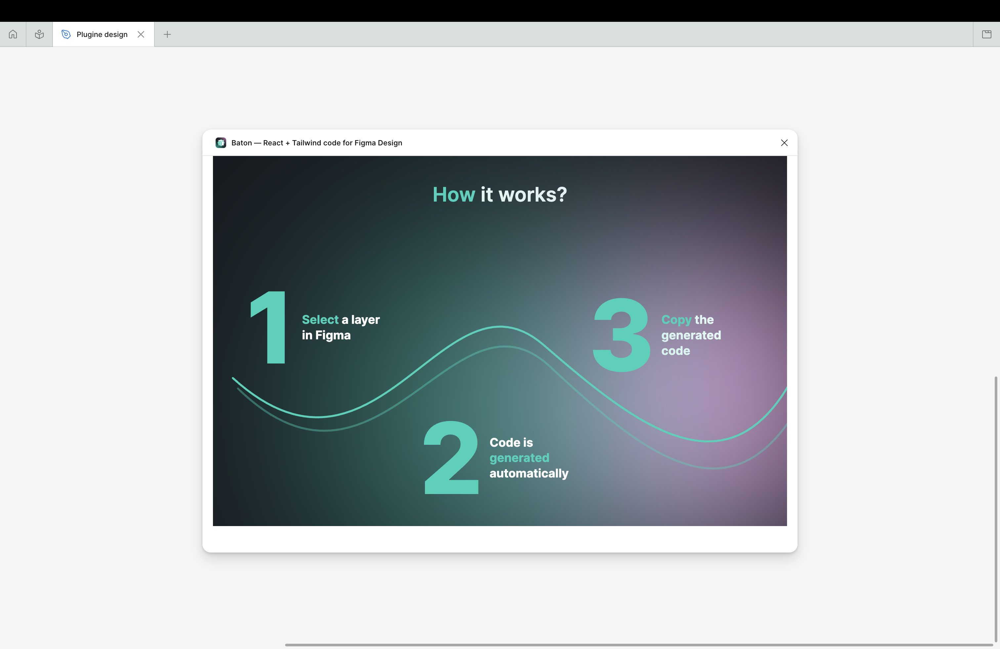

# Сards group

Six identical cards that the designer had split into three frames of two. Each
card holds a photo masked by an organic shape, a name, a role and a social badge.

**What is worth looking at in the output**

- the three frames became grid, add the six cards one `Card` + one `items` array;
- the photo keeps the blob shape as a real `clip-path`, not a square crop;
- the social badge moved to `icons.tsx` as its own component.

**Files below are the plugin's output, unedited.**

